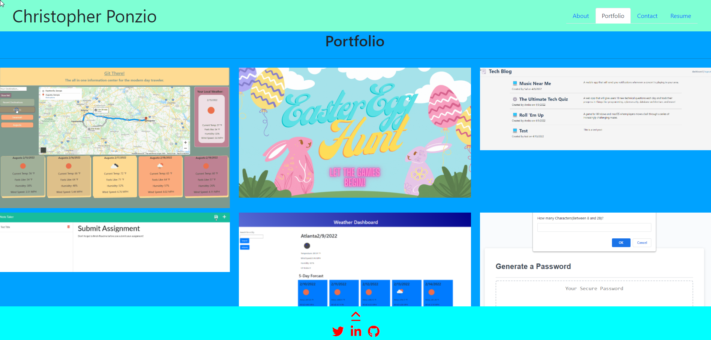

# React-Portfolio

## Description
This is a React Portfolio Template. You can add your own projects, images, and contact inofrmation into this template.

## Installation
To install this React Portfolio Template you can copy this repository and run NPM I using node.js.

## Usage
The React Portfolio Template can be used to show off your own projects wether it be photography, coding, sports, art, etc. Just install this template and add your images to the images folder and save the name to the project file. 

## Credits
 * Mickelle Blackwell
        github: https://github/Mblackwellgca
 * https://stackoverflow.com 
 * https://w3schools.com 
 * https://choosealicense.com 
 * https://img.shields.io
 * https://github.com     

## Source
 * Live Url: https://christopherponzio.github.io/React-Portfolio
 * Repository: https://github.com/ChristopherPonzio/React-Portfolio

## License
Licensed under the MIT license.
    https://choosealicense.com/licenses/mit